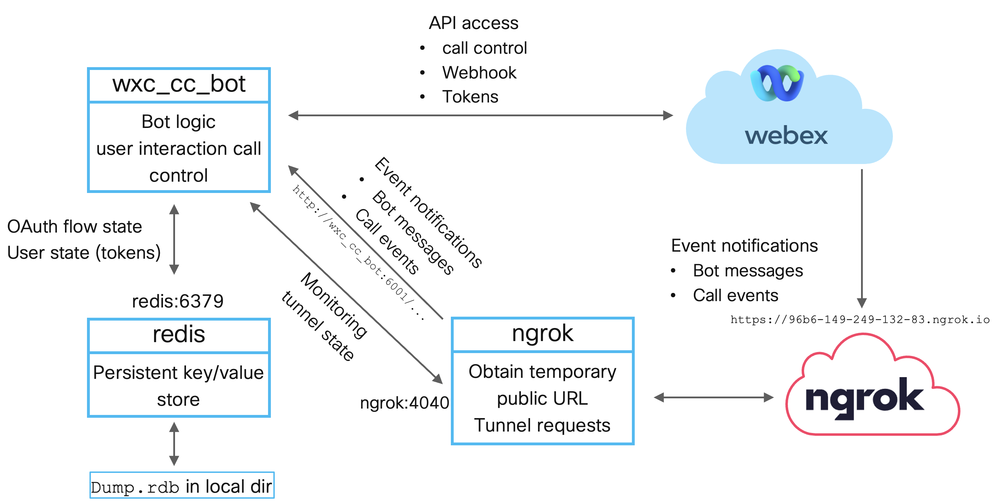

Running in Docker
=================

The distribution includes a ``docker-compose.yml`` file so that ``docker-compose up -d --build`` can be used to build
or pull the required images and start all containers. The ``docker-compose.yml`` file defines three hosts:

* wxc_cc_bot: the actual bot.

* ngrok: This container is used to get a temporary public URL that is then redirected to the wx_cc_bot container.

  A public URI is needed so that the bot can set up webhooks to receive event notifications from Webex. This is needed
  both, to get notifications about new messages sent to the bot and call events.

* redis: The bot uses Redis to store state information for active authentication flows and user token information.

  When starting the containers the current directory is mapped to the ``/data`` directory within the Redis container so
  that Redis state can be persisted in ``dump.rdb`` on the local host.

The animation below shows the output of ``docker-compose-up``:

.. image:: png/docker-compose.gif

