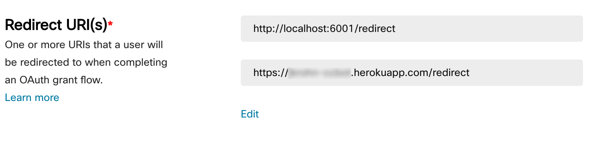

.. wxc_callcontrol documentation master file, created by
   sphinx-quickstart on Sun Feb 20 11:58:20 2022.
   You can adapt this file completely to your liking, but it should at least
   contain the root `toctree` directive.

Playing with Webex Calling call control APIs
============================================

.. toctree::
   :maxdepth: 2
   :caption: Contents:

   modules

The `Webex Calling call control APIs <https://developer.webex.com/docs/api/v1/call-controls>`_ offer a comprehensive
set of functions to control or establish calls on Webex Calling.

This project creates a small demo bot to interact with these APIs.

Homepage: https://github.com/jeokrohn/wxc_callcontrol

Documentation: https://wxc-callcontrol.readthedocs.io/en/latest/

Credentials
***********

All credentials that are required for the bot to run are defined in the sample .env file provided (".env (sample)").::

    # rename this to .env and set values

    # client ID for integration to be used. needs scopes as defined in class event_monitor.Integration
    WXC_CC_INTEGRATION_CLIENT_ID=

    # client secret of integration
    WXC_CC_INTEGRATION_CLIENT_SECRET=

    # bot email address
    WXC_CC_BOT_EMAIL=

    # bot access token
    WXC_CC_BOT_ACCESS_TOKEN=

    # bot name
    WXC_CC_BOT_NAME=

Bot credentials
^^^^^^^^^^^^^^^
``WXC_CC_BOT_EMAIL``, ``WXC_CC_BOT_ACCESS_TOKEN``, and ``WXC_CC_BOT_NAME`` are the details of the actual bot and are
obtained when creating the bot at `developer.webex.com <https://developer.webex.com/>`_ in the **My Webex Apps** section.

To use the Webex Calling call control APIs on behalf of a user the bot needs to obtain access tokens using an integration
with the required scopes. ``WXC_CC_INTEGRATION_CLIENT_ID`` and ``WXC_CC_INTEGRATION_CLIENT_SECRET`` are details of this
integration that also needs to be created in the **My Webex Apps** section at
`developer.webex.com <https://developer.webex.com/>`_.

Integration credentials
^^^^^^^^^^^^^^^^^^^^^^^
When creating the integration you need to make sure that the scopes you assign when creating the integration match the
scopes that are defined in class ``Integration`` in wxc_cc_bot.py.

When you plan to run the bot locally (either directly or in Docker) then you need to set the redirect URL to
``http://localhost:6001/redirect`` to make sure that the user's browser at the end of the OAuth flow gets redirected back to
an URL the bot listens on locally. When hosting your bot on Heroku (or some other hosting platform) you need to make
sure to also include a redirect URI pointing to that platform:

Docker (docker-compose)
***********************
The distribution includes a ``docker-compose.yml`` file so that ``docker-compose up -d --build`` can be used to build
or pull the required images and start all containers. The ``docker-compose.yml`` file defines three hosts:

* wxc_cc_bot: the actual bot.

* ngrok: This container is used to get a temporary public URL that is then redirected to the wx_cc_bot container.

  A public URI is needed so that the bot can set up webhooks to receive event notifications from Webex. This is needed
  both, to get notifications about new messages sent to the bot and call events.

* redis: The bot uses Redis to store state information for active authentication flows and user token information.

  When starting the containers the current directory is mapped to the ``/data`` directory within the Redis container so
  that Redis state can be persisted in ``dump.rdb`` on the local host.

Indices and tables
==================

* :ref:`genindex`
* :ref:`modindex`
* :ref:`search`
