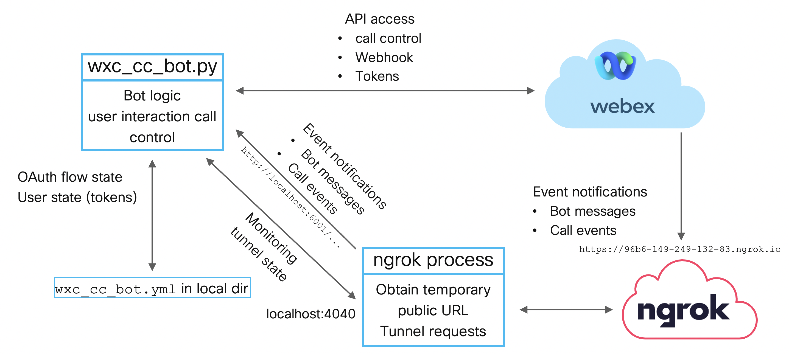

Running locally
===============

To start the bot locally ``wxc_cc_bot.py`` needs to be executed.

As soon as the bot in :meth:`wxc_cc_bot.create_app`
detects that it's not running on Heroku (environment variable ``HEROKU_NAME`` not set) a public URL for the bot is
determined by calling :meth:`ngrokhelper.get_public_url`.

The ngrok URL is either based on the value of the environment
variable ``NGROK_HOST`` (running in Docker) or a local ``ngrok`` process is started. In both cases
:meth:`ngrokhelper.get_public_url` polls the API of the ngrok instance (local process or in the ngrok docker container)
to determine the public URL that then can be used as the base URL for webhook creation.

* wxc_cc_bot.py: Bot logic. Reacts to message events for user interaction. The bot uses a local file
  (``wxc_cc_bot.yml``) to store state information (tokens) for authenticated users.

* ngrok: This process is started during initialization of the bot. Ngrok is used to get a temporary public URL that
  is then redirected to the wx_cc_bot container.

  A public URI is needed so that the bot can set up webhooks to receive event notifications from Webex. This is needed
  both, to get notifications about new messages sent to the bot and call events.
